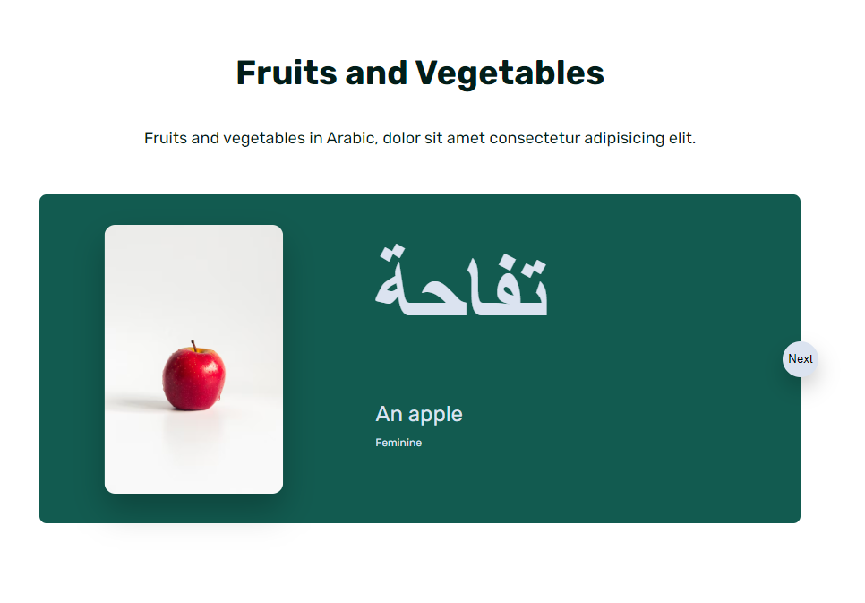
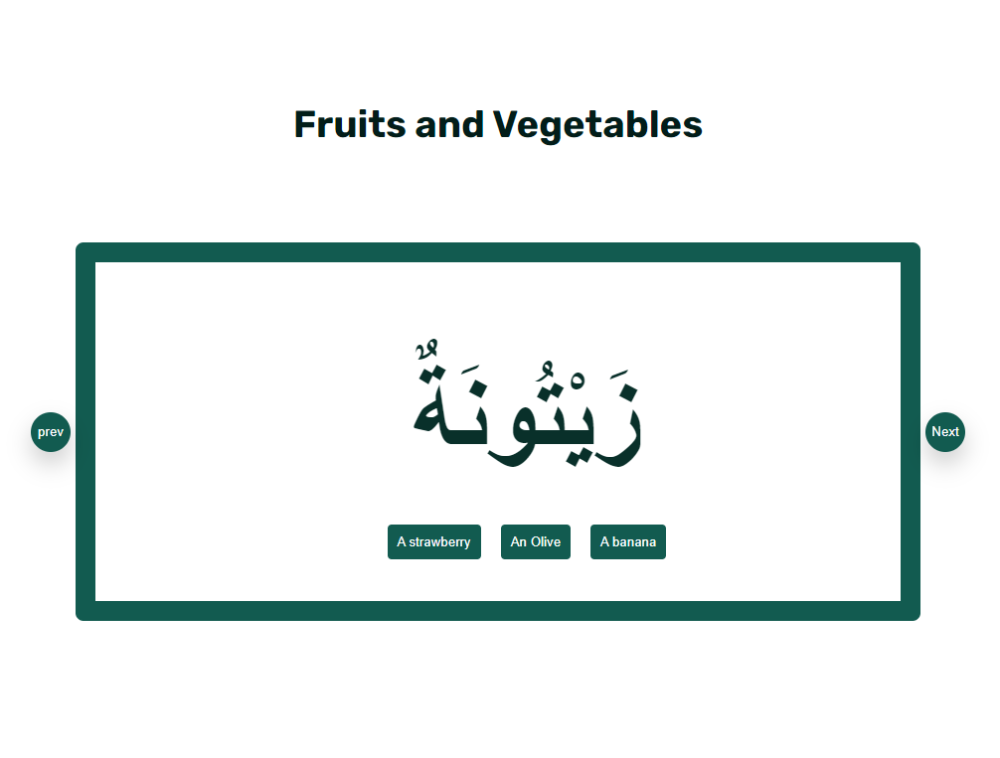

# Project Description

The project is based on the book: 'Gateway to Arabic level 2'; the content is from the book but it does not cover all the learning concepts such as the grammer.

The user is expected to have finished level 1 on be able to recognise and read basic Arabic.

The lessons are seperated into topics for example: fruits and vegetables, animals and colours - the user can pick and choose the topic they wish to learn. There's a interactive quiz part where the user can challenge/test their knowledge of that particular topic.

Lesson screenshot:

Quiz screenshot:

### Quick Start

npm start
[Server](https://github.com/New-Arday/learn-arabic-server)

For this project, I've used React for the client side and used CSS for styling. For the server and data, I've used: Nodejs,express, prisma and postgres.

#Diagrams
Included in this file , there are ERD and wireframes in which I used to help me stucture/guide my every step throuh this project.

#Learnings

I've had fun creating this project and learned so much while doing it. Starting with the importance of creating and having a user stories to help you stay on track. I would say that my Javascript has also improved.
